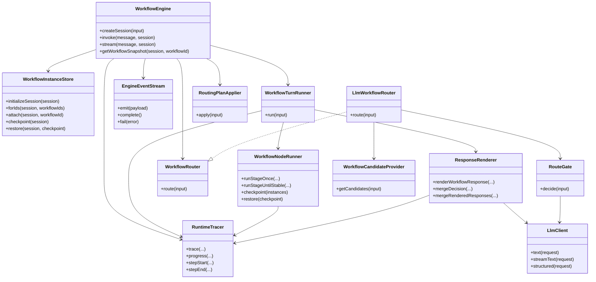
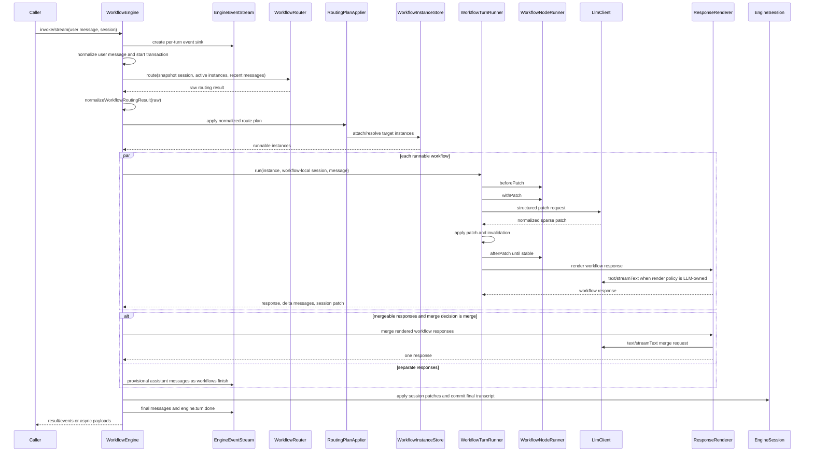

# @pac/engine Architecture Review

This note records the current engine package boundaries after reviewing every file under
`packages/engine/src`. It is intentionally implementation-facing: public API details stay in
`README.md` and `docs/API.md`.

## Package Boundary

`@pac/engine` owns runtime orchestration around workflow artifacts from `@pac/workflow`:

- routing a user turn to workflow ids;
- creating and checkpointing per-session workflow instances;
- building workflow-local message history;
- running patch, invalidation, nodes, and render;
- streaming trace/progress/message events;
- committing engine-level session messages only after a successful turn;
- adapting LLM requests and validating provider boundaries.

It must not own workflow authoring semantics, connector business behavior, or recovery retries for
malformed patch structured output.

## Class Dependency Graph

## Turn Data Sequence

## Reviewed Source Inventory

### Public and CLI

| File | Responsibility | Review result |
| --- | --- | --- |
| `src/index.ts` | Package root exports. | Keep thin; no internal runtime types exported. |
| `src/routing.ts` | Routing facade re-export. | Clear facade; no behavior. |
| `src/types.ts` | Public engine types and event payload contracts. | Removed unused internal `TargetSelection`/`RecentWorkflowMessage` surface. |
| `src/cli.ts` | Executable chat/case runner. | Acceptable as a command entry point; not split into extra objects. |
| `src/cli/support.ts` | CLI argument parsing, logger, LLM config. | Cohesive; log parsing stays CLI-only. |
| `src/cli/module-loader.ts` | Dynamic workflow/connector ESM boundary. | Cohesive; schema checks stay here. |
| `src/cli/agent-manifest.ts` | Agent manifest discovery and normalization. | Cohesive; no runtime coupling. |
| `src/typebox-tool.manual.ts` | Manual network smoke test for pi-ai tool calls. | Keep outside default unit path. |

### Routing

| File | Responsibility | Review result |
| --- | --- | --- |
| `src/routing/router.ts` | Router contract and defensive output normalization. | Moved normalization here from `WorkflowEngine`. |
| `src/routing/llm-workflow-router.ts` | Protocol fast path, candidates, LLM gate decision validation. | Cohesive; no engine mutation. |
| `src/routing/route-gate.ts` | Provider-facing route gate prompt and messages. | Cohesive; uses session snapshot. |
| `src/routing/candidate-provider.ts` | Candidate profile provider abstraction. | Small and justified extension point. |
| `src/routing/protocol-fast-path.ts` | Ack-only fast path. | Correctly narrow; avoids keyword routing. |
| `src/routing/routing-plan-applier.ts` | Applies normalized routing lifecycle changes. | Return shape simplified to runnable instances. |
| `src/routing/schemas.ts` | Raw LLM route decision schema. | Keep as schema-only boundary. |
| `src/routing/workflow-profile.ts` | Compact workflow profile projection. | Cohesive; no prompts or state. |

### Runtime

| File | Responsibility | Review result |
| --- | --- | --- |
| `src/engine.ts` | Public facade, turn transaction, orchestration, final commit. | Reduced routing helper burden; added file boundary comment. |
| `src/session.ts` | Session construction and clone policies. | Centralized extension vs workflow-runtime clone behavior. |
| `src/patching.ts` | Sparse patch normalization/application. | Fixed explicit `null` business values; added boundary comments. |
| `src/runtime/boundary.ts` | Runtime workflow artifact invariant checks. | Correct owner for registration-time validation. |
| `src/runtime/instances.ts` | Per-session workflow instance lifecycle and rollback checkpoint. | Cohesive; file comment added. |
| `src/runtime/workflow-turn-runner.ts` | One workflow's turn lifecycle. | Removed duplicate session clone helper; file comment added. |
| `src/runtime/node-runner.ts` | Node execution, dependency memory, prefetch/effect side effects. | Cohesive despite size; file comment added. |
| `src/runtime/mutations.ts` | Patch/invalidation mutation helpers. | Narrow and clear. |
| `src/runtime/response-renderer.ts` | Workflow render and merged response presentation. | Cohesive; file comment added. |
| `src/runtime/tracer.ts` | Trace/log/event emission. | Correct diagnostic owner. |
| `src/runtime/events.ts` | Per-turn async iterable event bridge. | Small queue abstraction is justified. |

### LLM and Utilities

| File | Responsibility | Review result |
| --- | --- | --- |
| `src/llm/client.ts` | pi-ai adapter and request/response validation calls. | File comment added; no patch retry logic. |
| `src/llm/request-boundary.ts` | Zod validation for LLM options and requests. | Cohesive boundary layer. |
| `src/llm/models.ts` | Provider model selection and request override. | Small, clear. |
| `src/llm/structured-output.ts` | Structured-output tool metadata and system prompt contract. | Cohesive; no workflow logic. |
| `src/utils/messages.ts` | Workflow message normalization and provider conversion. | Cohesive; tool messages become fact text. |
| `src/utils/json.ts` | Diagnostic stringify and JSON-native semantic comparison. | Cohesive; not used for persistence. |
| `src/utils/rendering.ts` | Render response and stream event boundary validation. | Small, clear. |
| `src/utils/schema-boundary.ts` | Shared Zod boundary helpers. | Cohesive; used by CLI/LLM boundaries. |
| `src/utils/state.ts` | State reset and pre-state access helpers. | Small, justified. |
| `src/utils/turn.ts` | Per-turn change tracking. | Small object model is justified by workflow callback API. |
| `src/utils/logging.ts` | Engine log line formatting. | Small, clear. |
| `src/utils/errors.ts` | Unknown error formatting. | Small, clear. |

### Tests

| File | Responsibility | Review result |
| --- | --- | --- |
| `src/engine.unit.test.ts` | End-to-end deterministic engine behavior across routing, patching, nodes, render, stream, rollback. | Large but currently valuable as a runtime contract suite. |
| `src/cli.unit.test.ts` | CLI parsing, manifest/module loader, connector loading, non-debug logging. | Cohesive; uses temporary modules to protect dynamic boundary. |
| `src/llm/client.unit.test.ts` | LLM request boundary validation before provider calls. | Cohesive; no network calls. |
| `src/patching.unit.test.ts` | Patch/session/object mutation semantics. | Updated for explicit null state patches. |
| `src/utils/json.unit.test.ts` | Diagnostic stringify and runtime equality semantics. | Cohesive. |
| `src/utils/messages.unit.test.ts` | Workflow message/provider conversion. | Cohesive. |

## Changes Made From Review

- Router output normalization moved from `WorkflowEngine` to `routing/router.ts`, where custom router output belongs.
- `RoutingPlanApplier.apply(...)` now returns runnable instances directly instead of an object with an unused `ids` set.
- Removed unused internal types from `types.ts`.
- Session clone policy is centralized in `session.ts`; workflow runtime views share `sharedCache`, extension snapshots do not.
- Patch normalization now preserves explicit `null` state values and only drops `undefined` plus reserved runtime fields.
- Core files now include file-level boundary comments describing ownership and prohibited responsibilities.

## Remaining Watchpoints

- `src/engine.unit.test.ts` is intentionally broad and currently serves as the executable architecture contract. If it grows again, split by runtime domain rather than by arbitrary line count.
- `src/runtime/node-runner.ts` is large, but its responsibilities are tightly coupled around node execution. Splitting it before command nodes or more node kinds exist would create indirection without reducing behavior.
- `src/cli.ts` contains presentation and interactive command logic. It is acceptable while the CLI remains a dev tool; promote helpers only when another command needs the same behavior.
